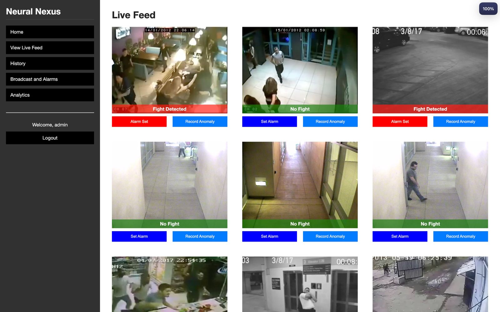
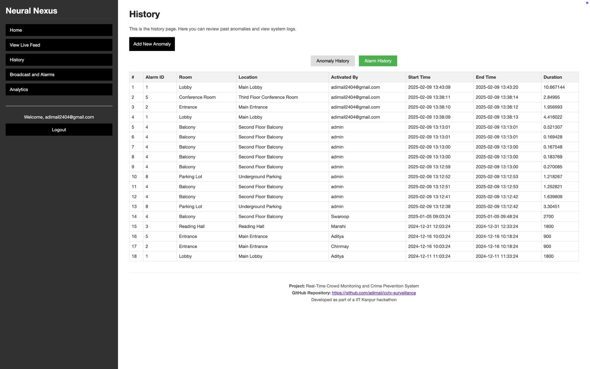
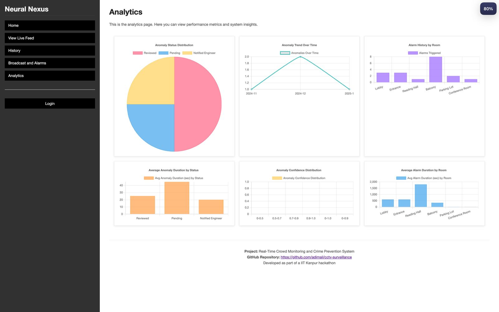
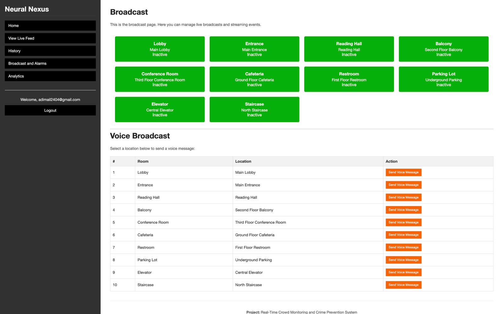
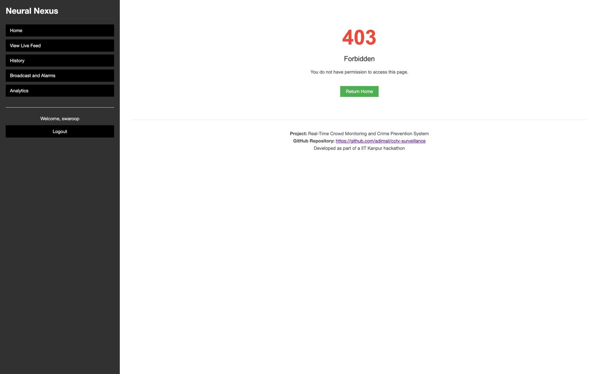

# Neural Nexus Dashboard

Neural Nexus Dashboard is a comprehensive security and surveillance web application that leverages existing CCTV networks, machine learning, and real-time analytics to detect fights and manage broadcasts across various locations. The platform provides live feeds, historical logs, advanced analytics, and role-based controls to ensure efficient monitoring and rapid response.

## Features

- **Real-Time Fight Detection:** Processes live CCTV video streams using a custom ML model with an AttentionLayer to detect fights in real time.
- **Live Feed Display:** Presents live video streams from security cameras with real-time ML predictions (fight vs. no fight).
- **Historical Data Logging:** Logs anomaly events and alarm history with detailed timestamps, durations, and actions taken.
- **Analytics Dashboard:** Visualizes performance metrics and insights using Chart.js, including anomaly status distribution, trend analysis, and alarm durations.
- **Voice Broadcast:** Allows admins to send voice messages to specific rooms by recording audio from the browser microphone.
- **Text Broadcast:** Enables admins to send text broadcast messages to various locations.
- **Role-Based Access Control:** Only authenticated users can view feeds, while administrative tasks such as broadcast and data management are restricted to admins.
- **Rate Limiting:** All routes are rate limited to prevent abuse using Flask-Limiter.
- **Modular Architecture:** Built using Flask blueprints for feed, broadcast, history, authentication, and analytics.
- **Data Management Scripts:** Includes scripts to seed sample data and clear anomalies and alarm history.

## Technologies Used

- **Backend:** Flask, Flask-Login, Flask-SQLAlchemy, Flask-Limiter, TensorFlow
- **Frontend:** HTML, CSS, JavaScript, Chart.js (via CDN)
- **Machine Learning:** Custom ML model with attention layer for fight detection
- **Database:** SQLite (local database file)

## Installation

1. **Clone the repository:**

   ```bash
   git clone https://github.com/adimail/cctv-surveillance.git
   cd cctv-surveillance
   ```

2. **Create a virtual environment and activate it:**

   ```bash
   python3 -m venv .venv
   source .venv/bin/activate   # On Windows: .venv\Scripts\activate
   ```

3. **Install the required packages:**

   ```bash
   pip install -r requirements.txt
   ```

4. **Set up the database and seed initial data:**

   ```bash
   python create_db.py
   ```

   _Optionally, use `clear_data.py` to reset anomaly and alarm history data._

## Running the Application

To run the application, execute:

```bash
python3 app.py
```

Then, open your browser and navigate to `http://localhost:5000` to access the dashboard.

## Project Structure

```
cctv-surveillance/
├── app/
│   ├── __init__.py
│   ├── models.py
│   ├── extensions.py
│   ├── blueprints/
│   │   ├── auth.py
│   │   ├── feed.py
│   │   ├── history.py
│   │   ├── broadcast.py
│   │   └── analytics.py
│   ├── model/
│   │   └── fight_detection_model.h5
│   └── ...
├── static/
│   ├── css/
│   │   ├── index.css
│   │   ├── broadcast.css
│   │   ├── analytics.css
│   │   └── auth.css
│   ├── js/
│   │   ├── analytics.js
│   │   └── ...
│   └── videos/
│       └── ...
├── templates/
│   ├── base.html
│   ├── feed.html
│   ├── login.html
│   ├── register.html
│   ├── history.html
│   ├── add_anomaly.html
│   ├── edit_anomaly.html
│   ├── broadcast.html
│   ├── analytics.html
│   └── ...
├── create_db.py
├── clear_data.py
├── requirements.txt
└── README.md
```

## Screenshots

Below are sample screenshots demonstrating key features of the Neural Nexus Dashboard.

- **Live Feed:**
  
- **History:**
  
- **Analytics Dashboard:**
  
- **Broadcast Page:**
  
- **Authorised access:**
  

## Usage

- **Login:**
  All users must log in. Only admins have access to broadcast, anomaly addition, and editing.
- **Live Feed:**
  Displays video streams from security cameras with real-time fight detection using an ML model.
- **History:**
  Admins can add and edit anomaly records while all users can view anomaly and alarm history.
- **Analytics:**
  Provides interactive charts for anomaly trends, status distribution, and alarm data.
- **Broadcast:**
  Admins can toggle alarms and send voice messages to designated rooms.

## License

[MIT License](LICENSE)

## Acknowledgements

- Thanks to the contributors of Flask, TensorFlow, and Chart.js for making this project possible.
- This project was developed as part of an IIT Kanpur hackathon.
